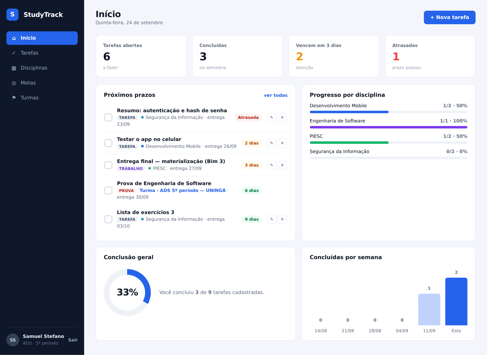
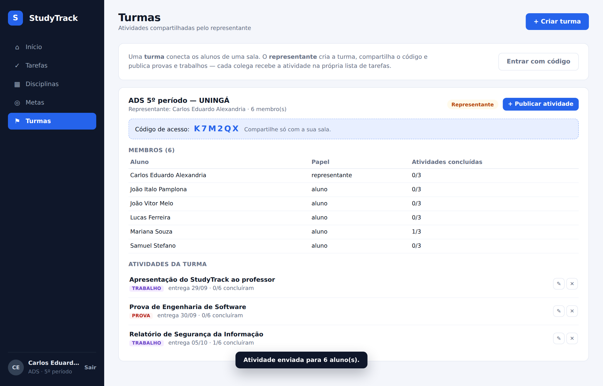
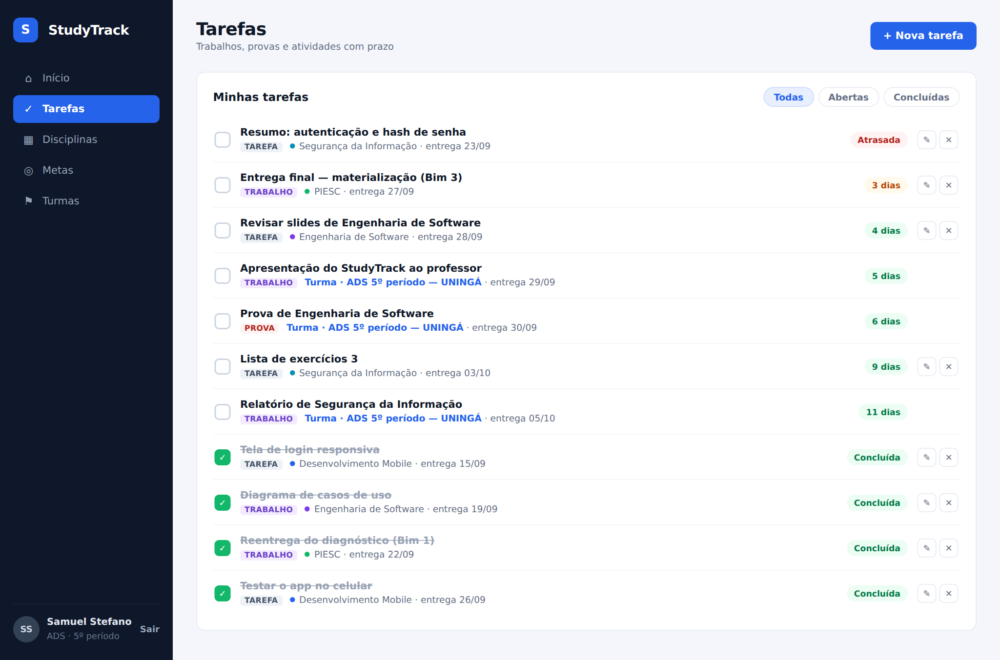
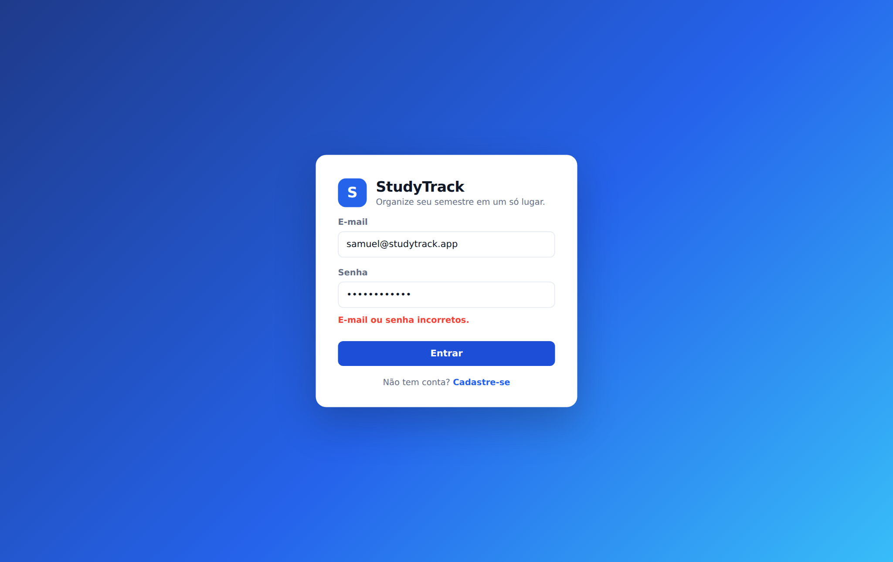
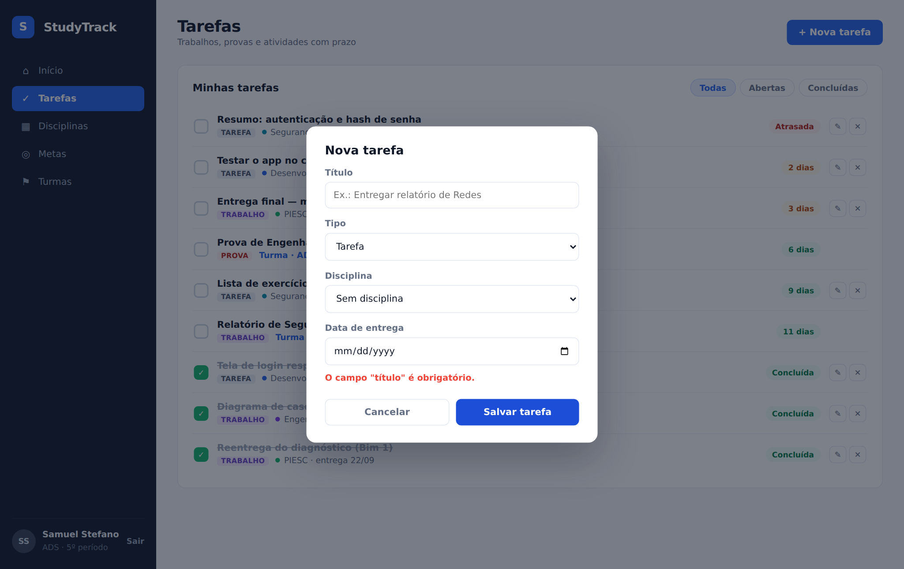
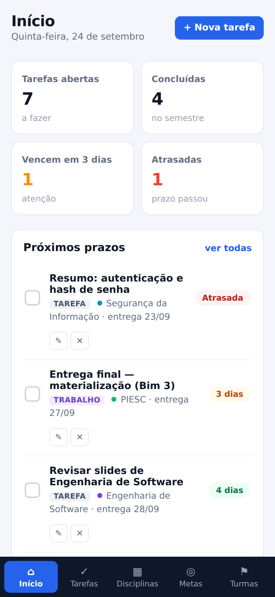
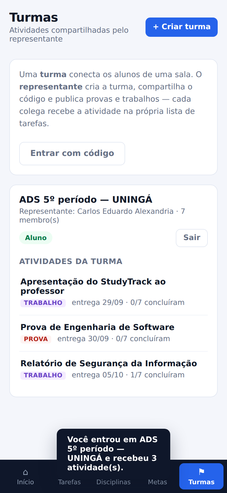

# Entrega do 3º bimestre — StudyTrack v1.0.0

Versão apresentada: **v1.0.0**, branch `feat/materializacao-bim03` (Pull Request #7), 25/09/2026.

## Objetivo

Ajudar o aluno da UNINGÁ a organizar o semestre num lugar só: disciplinas, tarefas, trabalhos, provas, prazos e metas. O representante da sala pode publicar provas e trabalhos, e eles aparecem para toda a turma.

## Como executar

Instruções completas em [`backend/README.md`](../backend/README.md). Resumo:

```bash
cd backend
npm install
cp .env.example .env
npm run seed
npm start          # http://localhost:3000
```

Login de teste: `samuel@studytrack.app` / `studytrack123` (aluno) ou `carlos@studytrack.app` / `studytrack123` (representante).

## Recursos entregues

- Cadastro e login (senha com hash, token com validade de 7 dias, bloqueio depois de 5 senhas erradas).
- Disciplinas: criar, editar e excluir, com o progresso de cada uma.
- Tarefas, trabalhos e provas: criar, editar, concluir, excluir e filtrar. Prazos com aviso de atrasada, hoje ou em N dias.
- Metas: "concluir N tarefas até tal data", com o progresso calculado sozinho.
- Painel inicial com contadores, próximos prazos, progresso por disciplina e concluídas por semana.
- Turmas: código de acesso, publicação de atividade para todos, lista de membros e quantos concluíram.
- Layout para celular, podendo instalar na tela inicial.
- 10 testes automatizados (`npm test`).

## Planejado x feito (roadmap de sprints)

| Sprint | Planejado | Situação |
|---|---|---|
| 1 | Planejamento: GitHub, backlog, equipe | Feito (abril) |
| 2 | Arquitetura: Flutter + FastAPI, endpoints iniciais | Feito com mudança: API em Express em vez de FastAPI |
| 3 | Banco de dados e CRUD | Feito (SQLite) |
| 4 | Usuários: cadastro, login, JWT | Feito |
| 5 | CRUD de matérias | Feito |
| 6 | CRUD de tarefas ligado às matérias | Feito |
| 7 | Integração geral | Feito: o app web é servido pela própria API |
| 8 | UX/UI | Feito, com versão para celular |
| 9 | Dashboard de progresso | Feito |
| 10 | Testes e documentação | Feito |
| — | Turmas (não estava no roadmap) | Adicionado |

## Evidências

Vídeo do fluxo completo: [`evidencias/18-demonstracao-studytrack.mp4`](evidencias/18-demonstracao-studytrack.mp4)

**Tela principal**



**Operação importante: representante publica uma prova e ela chega para o aluno**




**Situações inválidas**

Senha errada:



Tarefa sem título:



**No celular**

 

**Testes automatizados**

```
$ npm test
# tests 10
# pass 10
# fail 0
```

## O que ficou para depois

- Publicar em um endereço público (hoje roda só local).
- Lembretes e notificações de prazo.
- Recuperação de senha por e-mail.
- App Flutter usando esta mesma API.

## Problemas conhecidos e limitações

- Em alguns navegadores de computador, o campo de data aparece como mês/dia/ano, porque segue o idioma do navegador.
- O token de login fica salvo no navegador; em computador compartilhado é preciso clicar em "Sair".
- O banco é um arquivo SQLite sem backup automático.
- Precisa de Node.js 22.13 ou mais novo.
- O projeto Flutter na raiz do repositório ainda é o modelo inicial e não faz parte desta versão.

## Demonstração

A demonstração para o cliente foi feita em 24/09/2026 com a turma de ADS: Carlos como representante e os demais integrantes e colegas como alunos. Os detalhes estão no documento do PIESC do 3º bimestre.
